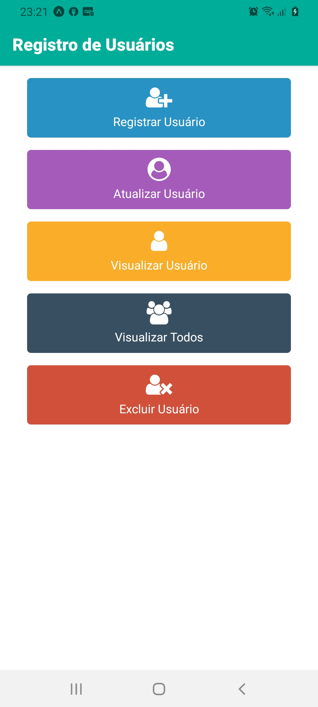
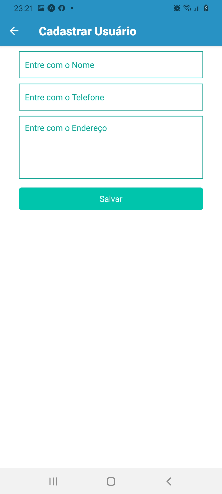
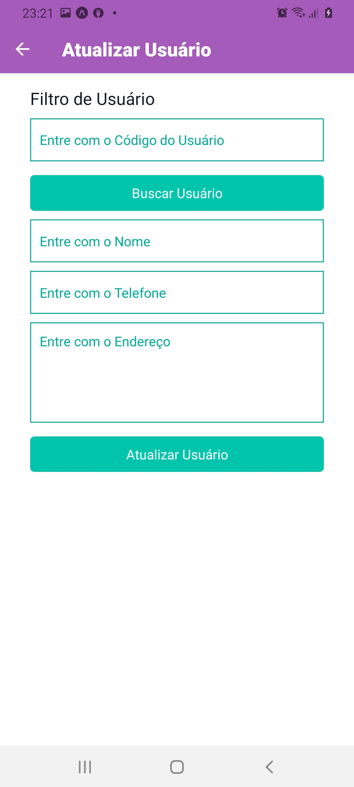
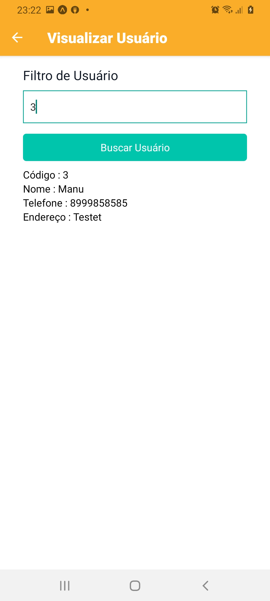
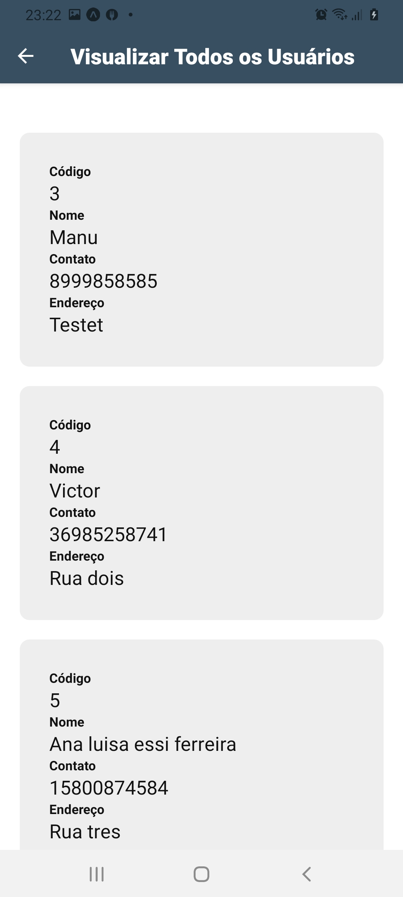
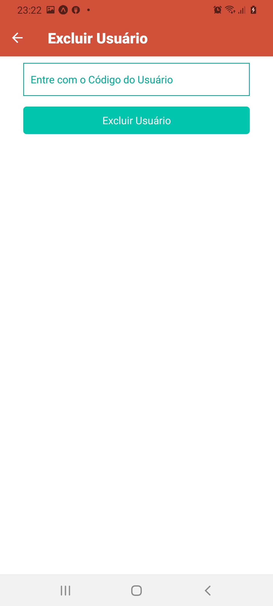

<!-- ************************************* Título ********************************************* -->
<h1> React Native com SQLite </h1>

## 🚀 Sobre o Projeto
</br>

Esse Projeto consiste em um App de Registro de Usuários, com as funcionalidades básicas de um CRUD ( Create / Read / Update / Delete ), utilizando o banco de Dados SQLite para gravação local dos dados. Ao rodar o projeto, ele verifica se o banco existe, caso não exista, ele cria o banco de dados e a estrutura da tabela, para já dar início a utilização do App.

</br>

## 🖼️ Imagens do Projeto

</br>

<div align="center">
  
  
  
  
  
  
</div>

</br>


* Dependências
  * @react-native-community/masked-view
  * @react-navigation/native
  * @react-navigation/stack
  * expo
  * expo-sqlite
  * expo-status-bar
  * react-native-gesture-handler  
  * react-native-reanimated
  * react-native-safe-area-context
  * react-native-screens 
  * react-native-vector-icons

</br>

<h3> 🎲 Rodando o Projeto</h3>

- É Necessário : 
    - Ter o Expo Instalado no PC
    - Ter o Expo Instalado no Celular

```bash
# Clone este repositório
$ git clone 

# Acesse a pasta do Projeto
$ cd CRUDReactNativeSQLite

# Baixar as dependências
$ yarn install
ou
$ npm install

# execute o comando
$ yarn start
ou
$ npm start

# O Expo é iniciado no pc mediante o browser e após esse processo acessar o celular e executar o expo
# e fazer a leitura do QRCode que é mostrado no bowser pelo Expo.

